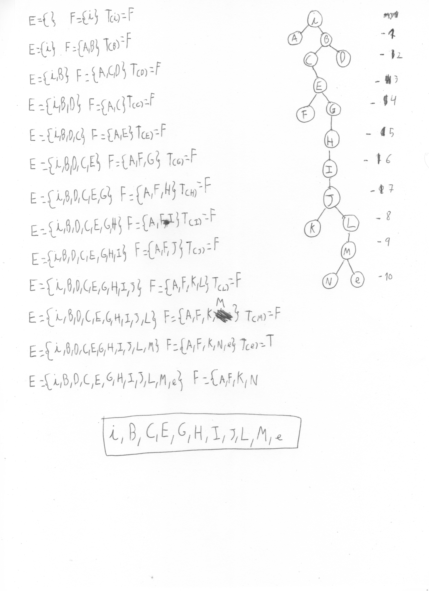
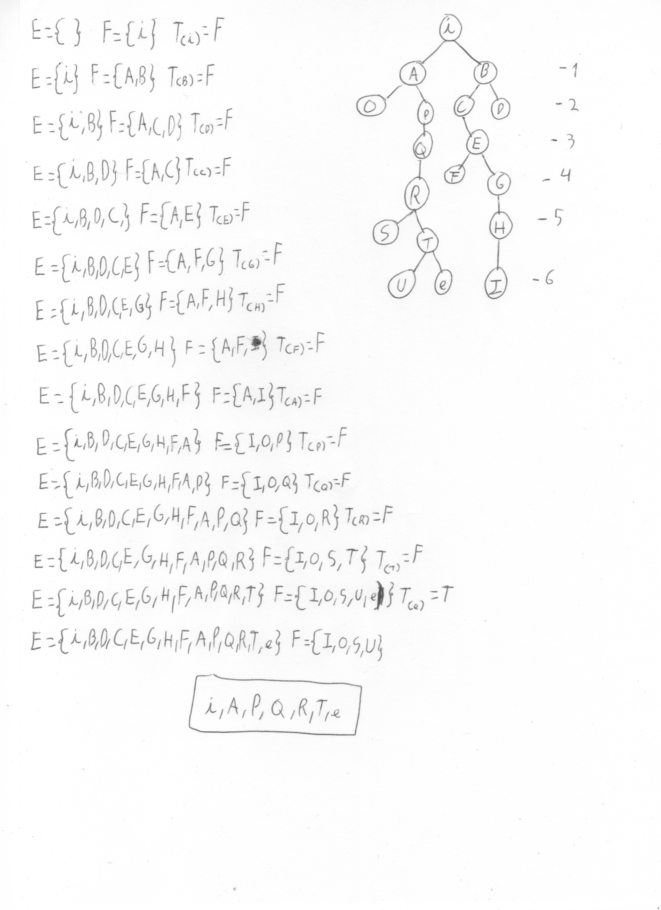
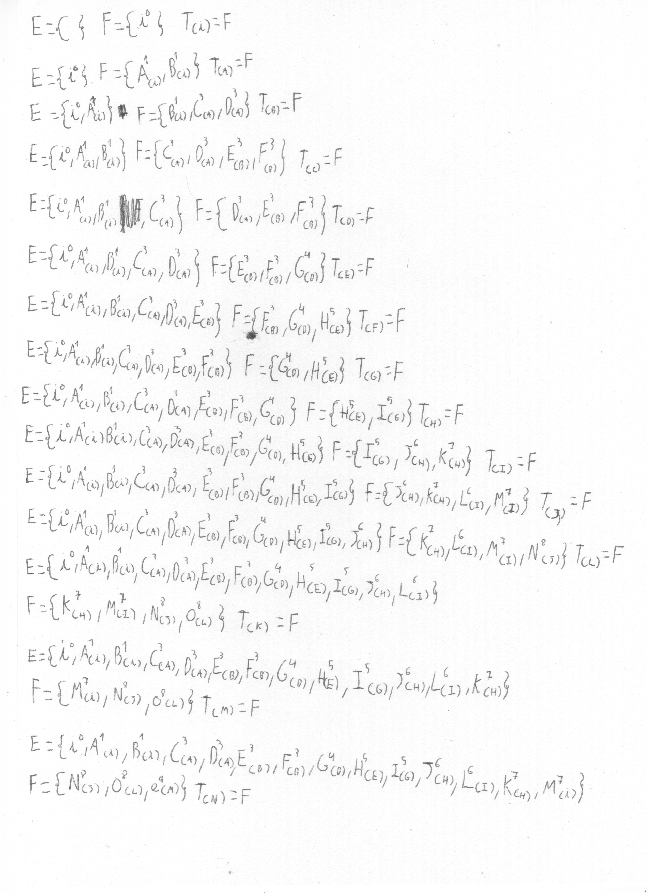
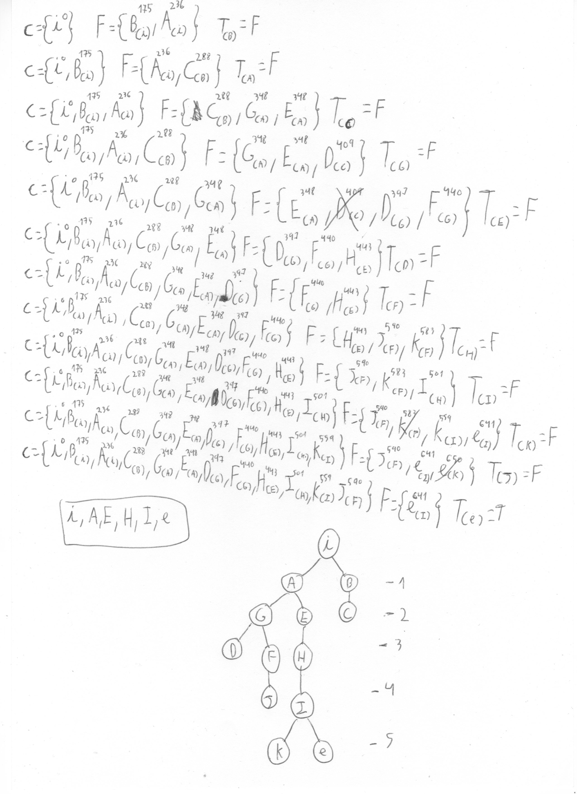
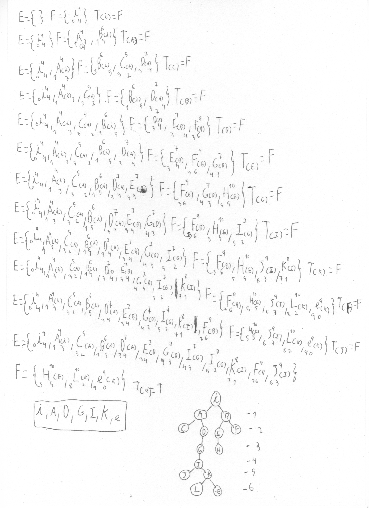

# EjerciciosModelos

## EJERCICIO BUSQUEDA EN PROFUNDIDAD (Empleado el algoritmo LIFO)
### SIN LIMITE

### LIMITE DE PROFUNDIDAD 5

**En este ejercicio de busqueda por profundidad podemos ver que si establecemos un limite a la busqueda este aspira a ser más corto puesto que "omitimos" posibles rutas, no obstante al marcar el limite de profundidad en 5 no se encontraría una solución y esto sería una fracaso de valor de corte**

## EJERCICIO DE COSTE UNIFORME (Empleado el algoritmo FIFO)
**(el siguiente apartado se hizo en base al mapa del ejercicio anterior pero considerando que un movimiento vertical tenia un valor de 1 y uno horizontal 2)**
### BUSQUEDA DE COSTE UNIFORME 1

### BUSQUEDA COSTE UNIFORME OURENSE-CALATAYUD

## EJERCICIO A Y A* (algoritomo empleado: FIFO)
Se puso que los movimientos verticales costaran 1 y lor horizontales 2. La heurística empleada fue la de **Distancia Manhattan**

**La heurística utilizada en el algoritmo A. es admisible? Por qué? Podemos decir que el algoritmo es A*?**
La heurística se puede admitir dado que ningun nodo supuso una sobrestimación en el coste final (real) de llegar al objetivo.
Por lo tanto podemos decir que el algoritmo es A* por cumplir los requisitos necesarios que son el uso de una heurística y completitud.
